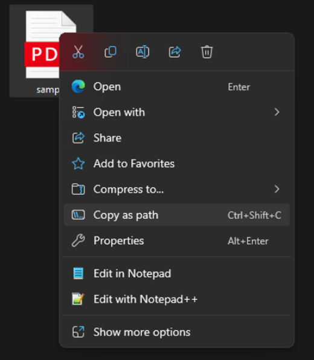

# PDF Invoice Text Extractor
A simple tool to extract text from invoices in PDF format and generate a CSV file with the extracted information in tabular format.

## Prerequisites
1. **.NET SDK**
Ensure that .NET SDK is installed on your machine. This project has been tested with version 9.0.200.
2. **AWS Account**
This tool requires access to AWS services, so ensure you have an AWS account and the necessary credentials.

## Setup Instructions
1. Clone the repository or download the project as a zip file.
2. Create a .env file in the project root and add the following environment variables with your AWS credentials
    ```bash
    AWS_ACCESS_KEY_ID="your_access_key"
    AWS_SECRET_ACCESS_KEY="your_secret_access_key"
    AWS_DEFAULT_REGION="your_region_name"
    AWS_BUCKET_NAME="your_bucket_name"
     ```

3. In the Program.cs file, update the `filePath` variable with the path to your PDF invoice file. You can right-click the PDF file, select `Copy as Path` and paste it as the value of the `filePath` variable in line 24.



4. To extract the text and generate the output CSV file, run the following command:
```bash
dotnet run
```
5. Once the application has run successfully, a file named output.csv will be generated in the root directory of the project. The extracted data will be available in tabular format within this CSV file.
